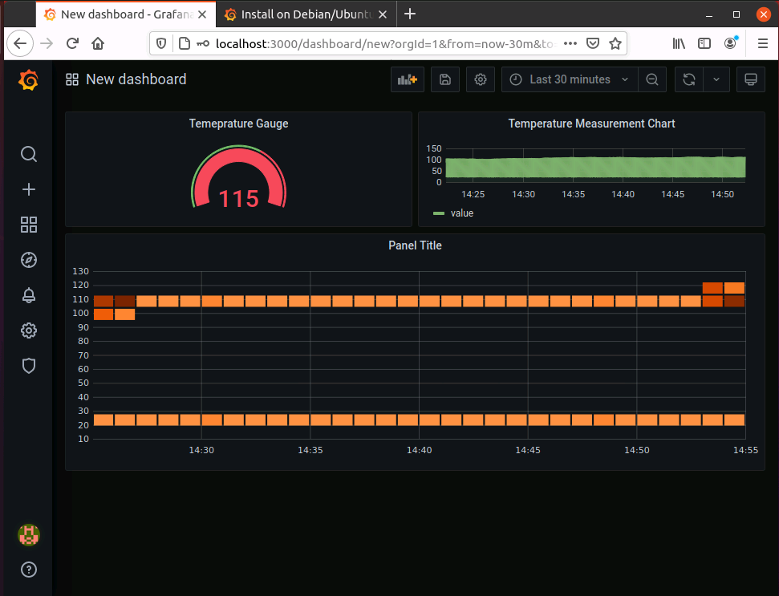

# Device Observability on the Edge with Azure IoT Edge & Azure IoT Central

In this learning path you will implement the following solution


- Create an IoT Central Application
- Create an Edge Device Template
- Create an edge device in IoT Central
- Prepare Ubuntu Box to run IoT Edge Runtime
- Provision Edge device in IoT Central
- Install Grafana on the Edge device
- Connect Grafana to SQL Edge
- Create Dashboards

## Azure IoT Central

Azure IoT Central is a hosted IoT app platform that’s secure, scales with you as your business grows, and integrates with your existing business apps.

### Create an IoT Central Application

Using Internet Browser Go to [IoT Central App](https://apps.azureiotcentral.com)

Click **Build** on the left Nav and click **Custom app** tile.


Create a new application.


Make sure to use **Customer application**.


### Create C# Module to capture data from sensor module and insert into SQL Server. 

Replace module name and password in the code to match your module name and database password.

#### Install .NET Core

To create Azure Functions locally using Visual Studio Code you will need .NET Core. Complete the following steps to install .NET Core.

1. Open a browser and navigate to [.NET Downloads](https://dotnet.microsoft.com/download).

2. Select the **Windows** tab and click **Download .NET Core SDK**

    **Note**: We are using .NET Core **not** .NET Framework.

    Once the download has completed, continue.

3. Launch the downloaded Microsoft .NET Core installer and click **Install**.

    When the **User Access Control** prompt is displayed, click **Yes**.

4. Once the installation has completed, click **Close**.

5. Open a **Command prompt** and enter the following command:

    ````script
    dotnet --version
    ````

    You should see a response similar to:

    ````script
    C:\>dotnet --version
    2.2.100

    C:\>
    ````

    


#### Download Docker

Go To [Docker](https://docs.docker.com/install/) to Install Docker for Windows or Mac. 


#### Verify Installation


1. In the **Command Prompt** window, enter the following:

    ````command
    docker --version
    ````

## Create Azure Container Registry

In this section, we are going to use the Azure Portal to create a Azure Container Registry (ACR).

1. Open a browser and navigate to [Azure Portal](https://portal.azure.com)

2. Click on **Create a Resource** -> **Containers** -> **Container Registry**

    

3. Provide a unique name to your container registry, enable admin user and click **Create**

    

4. Once your registry is created go to resource for details

    


## Create Sensor to SQL Module

The Azure IoT Edge extension for Visual Studio Code that you installed provides management capabilities as well as some code templates. You will use Visual Studio Code to create an IoT Edge solution that contains an Azure function.

1. In Visual Studio Code, open the Command Palette by pressing **CONTROL + SHIFT + P** and enter **Azure IoT Edge: New**.

    Choose **Azure IoT Edge: New IoT Edge Solution**.

    

2. A **Choose Folder** window will open, choose the location where you wish to create the solution.

3. In Visual Studio Code, under **Provide a Solution Name**, enter **SensorToSQL**.

4. Under **Select Module Template**, select **C# Module**.

    

5. Under **Provide Docker image repository for the module**, replace the value with the following:

    ````shell
    [registry name].azurecr.io/filterfunction
    ````

    Replace `[registry name]` with the registry name you created earlier. 

    **Note**: the repository name must be lowercase

7. New VS Code Window will be opened.

8. You will be prompted to set container registry crendetials. Click **Yes**

9. Opens a env file where you can set the credentials

10. Get the credentials from the portal. Go to Container Registry you created and click on **Access Keys**. Pick the username and password. In the image below the username and password have been grayed out. 

11. Replace the code with below code and update connection string accordingly 
    
    ````C#
    using System.Collections.Generic;
    using System.Threading.Tasks;
    
    using Microsoft.Azure.Devices.Client;
    using Microsoft.Azure.WebJobs;
    using Microsoft.Azure.WebJobs.Extensions.EdgeHub;
    using Microsoft.Extensions.Logging;
    using Newtonsoft.Json;
    
    using Sql = System.Data.SqlClient;
    
    namespace Functions
    {
        public static class sensorToSQL
        {
            [FunctionName("sensorToSQL")]
            public static async Task FilterMessageAndSendMessage(
                [EdgeHubTrigger("input1")] Message messageReceived,
                [EdgeHub(OutputName = "output1")] IAsyncCollector<Message> output,
                ILogger logger)
            {
                const int temperatureThreshold = 20;
                byte[] messageBytes = messageReceived.GetBytes();
                var messageString = System.Text.Encoding.UTF8.GetString(messageBytes);
    
                if (!string.IsNullOrEmpty(messageString))
                {
                    logger.LogInformation($"Info: Received one non-empty message\n\t'{messageString}'");
                    // Get the body of the message and deserialize it.
                    var messageBody = JsonConvert.DeserializeObject<MessageBody>(messageString);
    
                    //Store the data in SQL db
                    const string str = "Data Source=tcp:[module_name],1433;Initial Catalog=[MeasurementsDB];User Id=SA;Password=[xxxxxxx];TrustServerCertificate=False;Connection Timeout=30;";
                    using (Sql.SqlConnection conn = new Sql.SqlConnection(str))
                    {
                        conn.Open();
    
                        var insertMachineTemperature = "INSERT INTO MeasurementsDB.dbo.TemperatureMeasurements VALUES (CONVERT(DATETIME2,'" + messageBody.timeCreated + "', 127), 'machine', " + messageBody.machine.temperature + ");";
                        var insertAmbientTemperature = "INSERT INTO MeasurementsDB.dbo.TemperatureMeasurements VALUES (CONVERT(DATETIME2,'" + messageBody.timeCreated + "', 127), 'ambient', " + messageBody.ambient.temperature + ");";
                        using (Sql.SqlCommand cmd = new Sql.SqlCommand(insertMachineTemperature + "\n" + insertAmbientTemperature, conn))
                        {
                            //Execute the command and log the # rows affected.
                            var rows = await cmd.ExecuteNonQueryAsync();
                            logger.LogInformation($"{rows} rows were updated");
                        }
                    }
    
                    if (messageBody != null && messageBody.machine.temperature > temperatureThreshold)
                    {
                        // Send the message to the output as the temperature value is greater than the threashold.
                        using (var filteredMessage = new Message(messageBytes))
                        {
                            // Copy the properties of the original message into the new Message object.
                            foreach (KeyValuePair<string, string> prop in messageReceived.Properties)
                            {
                                filteredMessage.Properties.Add(prop.Key, prop.Value);
                            }
    
                            // Add a new property to the message to indicate it is an alert.
                            filteredMessage.Properties.Add("MessageType", "Alert");
    
                            // Send the message.
                            await output.AddAsync(filteredMessage);
    
                            logger.LogInformation("Info: Received and transferred a message with temperature above the threshold");
                        }
                    }
                }
            }
        }
    
        //Define the expected schema for the body of incoming messages.
        class MessageBody
        {
            public Machine machine {get; set;}
            public Ambient ambient {get; set;}
            public string timeCreated {get; set;}
        }
    
        class Machine
        {
            public double temperature {get; set;}
            public double pressure {get; set;}
        }
    
        class Ambient
        {
            public double temperature {get; set;}
            public int humidity {get; set;}
        }
    }
    
    ````

    If your project shows error do a dotnet restore. Open a terminal and go to your project modules folder and type in dotnet restore. Once done close the FilterFunction.cs file and reopen.

12. Open the VS Code integrated terminal by selecting **View > Terminal**.

    Sign in to your container registry by entering the following command in the integrated terminal.

    Use the username and login server that you copied from your Azure container registry earlier.

    ```bash
    docker login -u <ACR username> <ACR login server>
    ```

    When you are prompted for the password, paste the password for your container registry and press Enter.

    Password: <paste in the ACR password and press enter>
    
    Login Succeeded
    Hit ENTER to submit the password.

    Open the .env file in your IoT Edge solution workspace.

    This git-ignored file stores your container registry credentials so that you don't have to put them in the deployment manifest template. Provide the username and password for your container registry.

    In the .env file, provide the username and password for the Azure Container Registry.

    Save the changes to the .env file.

13. In the VS Code explorer, right-click the deployment.template.json file and select **Build and Push IoT Edge solution**.

    When you tell Visual Studio Code to build your solution, it first takes the information in the deployment template and generates a deployment.json file in a new folder named config. Then it runs two commands in the integrated terminal: docker build and docker push. These two commands build your code, containerize the functions, and then push the code to the container registry that you specified when you initialized the solution.

    You will see a lot of output generated during the process.

    **Build and Push**

    View your Container Image
    Visual Studio Code outputs a success message when your container image is pushed to your container registry. If you want to confirm the successful operation for yourself, you can view the image in the registry.


## Create Deployment Manifest

Use the following deployment manifest for this learning path. Replace ACR details below and your SQL server database password (DB details will be asked in the steps below when you setup your VM). 

````JSON
{
  "modulesContent": {
    "$edgeAgent": {
      "properties.desired": {
        "schemaVersion": "1.0",
        "runtime": {
          "type": "docker",
          "settings": {
            "minDockerVersion": "v1.25",
            "loggingOptions": "",
            "registryCredentials": {
              "registryCredentials": {
                "username": "<your acr username>",
                "password": "<your acr password>",
                "address": "<your acr address>.azurecr.io"
              }
            }
          }
        },
        "systemModules": {
          "edgeAgent": {
            "type": "docker",
            "settings": {
              "image": "mcr.microsoft.com/azureiotedge-agent:1.0",
              "createOptions": "{\"Binds\":[]}"
            }
          },
          "edgeHub": {
            "type": "docker",
            "status": "running",
            "restartPolicy": "always",
            "settings": {
              "image": "mcr.microsoft.com/azureiotedge-hub:1.0",
              "createOptions": "{\"HostConfig\":{\"PortBindings\":{\"5671/tcp\":[{\"HostPort\":\"5671\"}],\"8883/tcp\":[{\"HostPort\":\"8883\"}],\"443/tcp\":[{\"HostPort\":\"443\"}]}}}"
            }
          }
        },
        "modules": {
          "SensorToSQL": {
            "version": "1.0",
            "type": "docker",
            "status": "running",
            "restartPolicy": "always",
            "settings": {
              "image": "<your acr address>.azurecr.io/sensortosql:0.0.1-amd64",
              "createOptions": "{}"
            },
            "env": {
              "SA_PASSWORD": {
                "value": "<your database password>"
              },
              "SQL_SERVER_NAME": {
                "value": "SQLServerOne"
              },
              "DB_NAME": {
                "value": "MeasurementsDB"
              }
            }
          },
          "SimulatedTemperatureSensor": {
            "version": "1.0",
            "type": "docker",
            "status": "running",
            "restartPolicy": "always",
            "settings": {
              "image": "mcr.microsoft.com/azureiotedge-simulated-temperature-sensor:1.0",
              "createOptions": "{}"
            },
            "env": {
              "MessageCount": {
                "value": 1500
              }
            }
          },
          "SQLServerOne": {
            "version": "1.0",
            "type": "docker",
            "status": "running",
            "restartPolicy": "always",
            "settings": {
              "image": "mcr.microsoft.com/azure-sql-edge/developer:latest",
              "createOptions": "{\"HostConfig\":{\"CapAdd\":[\"SYS_PTRACE\"],\"Binds\":[\"sqlvolume:/sqlvolume\"],\"PortBindings\":{\"1433/tcp\":[{\"HostPort\":\"1433\"}]},\"Mounts\":[{\"Type\":\"volume\",\"Source\":\"sqlvolume\",\"Target\":\"/var/opt/mssql\"}]},\"Env\":[\"MSSQL_AGENT_ENABLED=TRUE\",\"ClientTransportType=AMQP_TCP_Only\",\"PlanId=asde-developer-on-iot-edge\"]}"
            },
            "env": {
              "ACCEPT_EULA": {
                "value": "Y"
              },
              "MSSQL_SA_PASSWORD": {
                "value": "<your database password>"
              },
              "MSSQL_LCID": {
                "value": "1033"
              },
              "MSSQL_COLLATION": {
                "value": "SQL_Latin1_General_CP1_CI_AS"
              }
            }
          }
        }
      }
    },
    "$edgeHub": {
      "properties.desired": {
        "schemaVersion": "1.0",
        "routes": {
          "sensorToSensorToSQL": "FROM /messages/modules/SimulatedTemperatureSensor/outputs/temperatureOutput INTO BrokeredEndpoint(\"/modules/SensorToSQL/inputs/input1\")",
          "AzureSQLEdgeOneToIoTHub": "FROM /messages/modules/SQLEdgeOne/outputs/* INTO $upstream"
        },
        "storeAndForwardConfiguration": {
          "timeToLiveSecs": 7200
        }
      }
    }
  }
}
````

## Create Device Template in IoT Central

Click on **Device template** tab in IoT Central and click **New**. Select IoT Edge and click **Next**. 

Upload the deployment you created in previous step and click **Next: Review**. Review page will show the modules you are going to deploy to the Edge device. 


Click **Create** and when you land on the device template page click **Publish**.

## Create a device in IoT Central

Click on **Devices** tab and select the device template tab. (the device template you created in the previous step). Click on **New** to create a new device. 


Click on **Connect** to get the device details. 


Copy the **ID Scope**, **Device ID** and **Primary Key** which will be needed in next steps. 


## Deploy Azure IoT Edge Enabled Linux VM

This learning path uses creating a Linux VM on windows machine. You can use any Linux VM to complete this learning path.

This **Ubuntu Server 20.04** based virtual machine will be used to install the latest Azure IoT Edge runtime and its dependencies.

### Steps to Create VM

1. Start Hyper-V Manager

2. Click on Quick Create to create a Linux VM
    

3. Select Ubuntu 20.04. Here are the supported OS versions for IoT Edge: [Supported OS Versions](https://docs.microsoft.com/en-us/azure/iot-edge/support?view=iotedge-2020-11)

    

4. Provide details and create a VM
    

5. Click **Start** button to start the VM.
    

6. Provide Credentials.
    

7. You will be presented with a Linux desktop. Right click and click on "Open a terminal". Pin the terminal for future use.
    

### Prepare the VM

This learning path uses IoT Edge 1.1 LTS version. You can find steps here: [1.1 LTS](https://docs.microsoft.com/en-us/azure/iot-edge/how-to-install-iot-edge?view=iotedge-2018-06) or follow along below steps


1. Use root user
    ````bash
      sudo su -
    ````

2. Update the VM with latest software
    ````bash
      apt update
    ````

3. Install repository configuration
    ````bash
      curl https://packages.microsoft.com/config/ubuntu/18.04/multiarch/prod.list > ./microsoft-prod.list
    ````

4. Install curl
    ````bash
      apt install curl
    ````

5. Copy the generated list to the sources.list.d directory
    ````bash
      sudo cp ./microsoft-prod.list /etc/apt/sources.list.d/
    ````

6. Install the Microsoft GPG public key
    ````bash
    curl https://packages.microsoft.com/keys/microsoft.asc | gpg --dearmor > microsoft.gpg
    sudo cp ./microsoft.gpg /etc/apt/trusted.gpg.d/
    ````

### Install container engine

1. Update package lists on your device
    ````bash
    sudo apt-get update
    ````

2. Update package lists on your device
    ````bash
    sudo apt-get install moby-engine
    ````

### Install IoT Edge & Provision Device

1. Update package lists on your device
    ````bash
    sudo apt-get update
    ````

2. Install IoT Edge runtime
    ````bash
    sudo apt-get install iotedge
    ````

3. Install IoT Edge runtime
    ````bash
    sudo apt-get install iotedge
    ````

4. Edit config.yaml file
    ````bash
    sudo nano /etc/iotedge/config.yaml
    ````

5. Comment out manual connection section


6. Edit DPS Symmetric key attestation provisioning section


7. Save and Exit 

8. Restart Edge to provision 
    ````bash
      systemctl restart iotedge
    ````

9. Edge Modules will be installed 
    ````bash
      iotedge list
    ````
    


10. Get the bash shell of the SQL Server container 
    ````bash  
    docker exec -it SQLServerOne bash
    ````

11. Login to SQL Server command line 
    ````bash  
    /opt/mssql-tools/bin/sqlcmd -S localhost -U SA -P "<your password>"
    ````

12. Create database 
    ````bash  
    CREATE DATABASE MeasurementsDB ON (NAME = MeasurementsDB, FILENAME = '/var/opt/mssql/measurementsdb.mdf')
    GO
    ````

13. Create table 
    ````bash  
    CREATE TABLE MeasurementsDB.dbo.TemperatureMeasurements (measurementTime DATETIME2, location NVARCHAR(50), temperature FLOAT)
    GO
    ````

14. Run select query to see the data. You will see data flowing into the table from sensor module


### Install Grafana

Go To Edge device and execute following commands in the terminal 

  ````bash  
  sudo apt-get install -y apt-transport-https
  sudo apt-get install -y software-properties-common wget
  wget -q -O - https://packages.grafana.com/gpg.key | sudo apt-key add -
  ````

Add this repository for stable releases:
  ````bash  
    echo "deb https://packages.grafana.com/oss/deb stable main" | sudo tee -a /etc/apt/sources.list.d/grafana.list
  ````

Execute the following commands 
  ````bash  
  sudo apt-get update
  sudo apt-get install grafana  
  ````


### Build Dashboards

Open a brownser on the Linux VM and go to http://localhost:3000

Grafana Dashboards will be displayed

Add a Datasource 


In the search box search for SQL Server and add 


Provide Connection details, save and test


When you make a successful connection you see this


Create a dashboard, Add a panel and edit to provide the SQL. Select a line chart


Complete your dashboard with the controls you need



